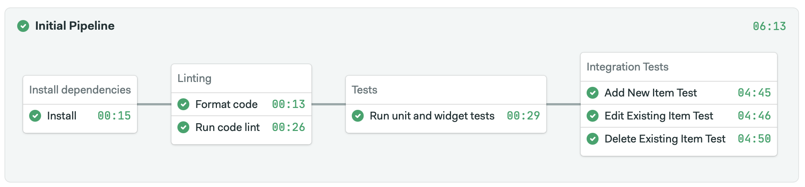

# Flutter 2.0 Test Demo

[](https://semaphore-demos.semaphoreci.com/projects/semaphore-demo-flutter2) [](https://pub.dev/packages/very_good_analysis)

Example repository showcasing a pipeline with different kinds of tests for a Flutter 2.0 application.

## Versions

| Name           | Version           |
| -------------- | ----------------- |
| Flutter SDK    | v2.2.2 (stable) |
| Dart SDK       | > 2.12.0        |


## Setup

1. Run diagnostics

Verify installed Flutter SDK version

```
flutter doctor -v
```

2. Clone the project

```
git clone https://github.com/semaphoreci-demos/semaphore-demo-flutter2
```

3. Install dependencies

```
flutter packages get
```

4. Run the project

```
flutter run
```

5. Run the unit & widget tests

```
flutter test test
```

6. Run the integration tests

For example, adding new item in the list

```
flutter test integration_test/add_new_todo_item_test.dart
```

See [integration_tests](https://github.com/semaphoreci-demos/semaphore-demo-flutter2/tree/main/integration_test) for the list of available integration tests.

## Continuous Integration

The demo includes a working [Semaphore][semaphore] CI in the `main` branch. Fork this repository and use it to [create your own project][create-project] on Semaphore.

The CI pipeline will look like this:



The example pipeline contains 4 blocks.

1. Install and cache Flutter dependencies.
2. Run Linting and code analysis tests.
3. Run unit and widget tests.
4. Run integration tests on an emulator.

## License

Copyright (c) 2021 Rendered Text

Distributed under the MIT License. See the file LICENSE.

[semaphore]: https://semaphoreci.com
